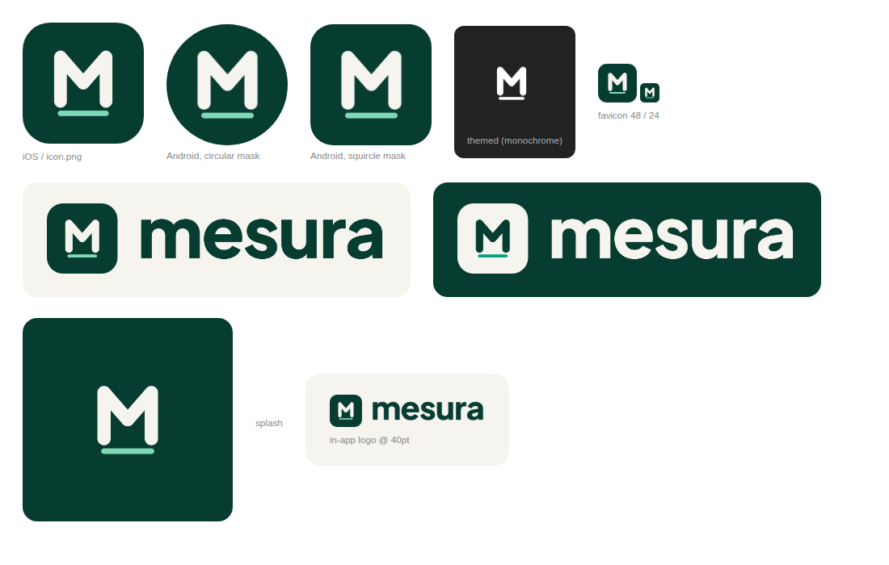

# Mesura — brand kit



## Idea

**Mesura** comes from *measure* / *sur mesure*: every card is made to measure.
The symbol is an **M standing on a measuring line**: your money, within the limit you set.

## Files

| File | Use |
| --- | --- |
| `mesura-symbol.svg` | App icon / avatar (rounded square, forest green) |
| `mesura-logo.svg` | Horizontal logo for light backgrounds |
| `mesura-logo-white.svg` | Horizontal logo for dark / forest-green backgrounds |
| `mesura-wordmark.svg`, `mesura-wordmark-white.svg` | Word only, when the symbol is already shown nearby |
| `png/` | Ready-to-use PNG exports (symbol 1024 px, logos 1600 px wide) |

App assets generated from the same source live in `apps/mobile/assets/`
(`icon.png`, Android adaptive icon layers, monochrome themed icon, splash, favicon, in-app logos).

## Colours

| Name | Hex | Role |
| --- | --- | --- |
| Forest | `#073D31` | Primary brand colour, icon background |
| Cream | `#F6F4EE` | Warm off-white, symbol on forest, app background |
| Mint | `#7FD8B8` | Measuring line on dark backgrounds |
| Accent | `#0AA17F` | Measuring line on light backgrounds, highlights |

## Typography

Wordmark: **Plus Jakarta Sans ExtraBold** (SIL Open Font License, `source/fonts/OFL.txt`),
converted to outlines — the logo files need no installed font. Always lowercase: `mesura`.

## Rules

- Keep clear space around the logo of at least the height of the measuring line × 2.
- Minimum size: symbol 24 px; horizontal logo 96 px wide.
- Don't recolour the measuring line in other colours, stretch, rotate, or add effects.
- On photos or busy backgrounds, use the symbol on its forest square.

## Regenerating

```bash
python3 -m venv /tmp/brand-venv && /tmp/brand-venv/bin/pip install fonttools
/tmp/brand-venv/bin/python brand/source/build.py . /tmp/mesura-brand-jobs
node brand/source/render.mjs /tmp/mesura-brand-jobs/jobs.json   # needs playwright-core (+ CHROMIUM_PATH)
```

Not yet checked: trademark availability (OAPI / international) for the name and the symbol.
